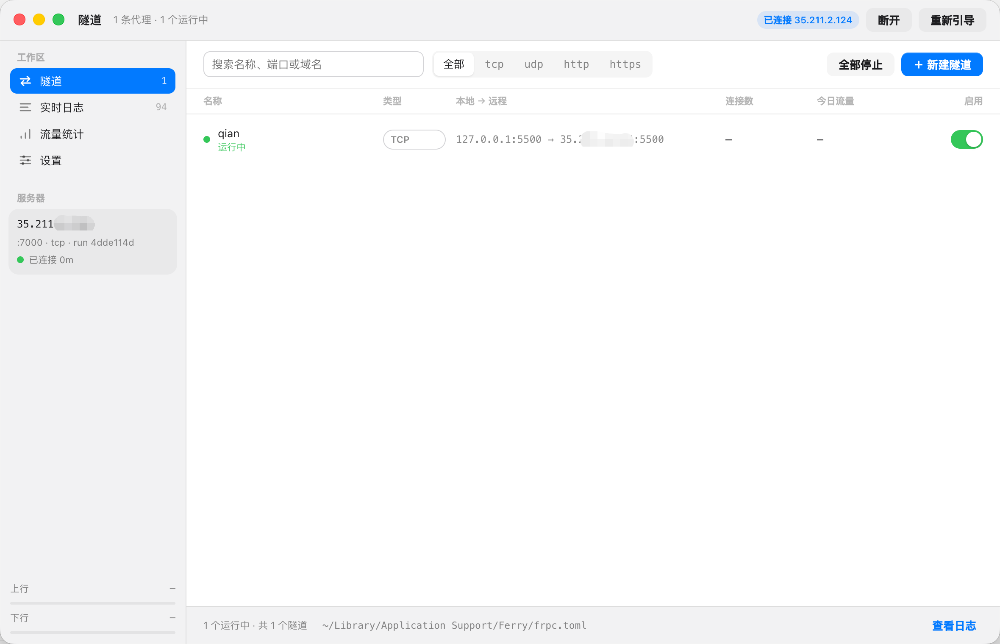

<p align="center">
  
</p>

<h1 align="center">Ferry</h1>

<p align="center">
  A modern, lightweight, and cross-platform FRP desktop client.
</p>

<p align="center">
  <a href="https://github.com/miwuyouth/Ferry/releases/latest"></a>
  
  <a href="LICENSE"></a>
</p>

<p align="center">
  <a href="README.md">简体中文</a> | <b>English</b>
</p>

---

**Ferry** is an elegant, lightweight `frpc` desktop client designed for **macOS**, **Windows**, and **Linux**. Say goodbye to cumbersome manual configuration files and command-line processes. Ferry turns tunnel management into an intuitive graphical interface, keeping real-time connection status and metrics accessible right from your menu bar or system tray.

<p align="center">
  
</p>

## Features

- **Modern Cross-Platform UI**: Clean, refined interface following modern design principles, with seamless support for light and dark modes, and menu bar / system tray integration.
- **Process Supervisor & Self-Healing**: Fully manages the `frpc` background process, with auto-start on boot, smart auto-reconnect on disconnect, and auto-recovery on crash.
- **Visual Tunnel Management**: Easily configure TCP, UDP, HTTP, and HTTPS proxy rules through forms, with support for individual tunnel toggling and hot reloading.
- **Status & Traffic Monitoring**: View connection status, average latency, uptime, and network throughput in real time, accompanied by a structured runtime log viewer.
- **Internationalization (i18n)**: Built-in multi-language support (English / Simplified Chinese), following system preferences or manual selection.
- **Flexible Import & Export**: Import and export standard `frpc.toml` configurations for quick synchronization across multiple devices.

---

## Download & Installation

### Option 1: Direct Download (Recommended)

Visit [GitHub Releases](https://github.com/miwuyouth/Ferry/releases/latest) to download the latest installer for your operating system:

#### macOS
* **Apple Silicon (M series)**: `Ferry-x.x.x-arm64.dmg`
* **Intel**: `Ferry-x.x.x.dmg`

> **"Cannot be opened" prompt on macOS?**  
> Because the app is not signed with a paid Apple Developer certificate, if macOS Gatekeeper blocks it on first open, locate the app in Finder, **Right-click -> Open**, and click "Open" in the confirmation dialog (only needed once).

#### Windows
* **Installer**: `Ferry-Setup-x.x.x.exe`
* **Portable ZIP**: `Ferry-x.x.x-win-x64.zip`

#### Linux
* **AppImage (Recommended, portable)**: `Ferry-x.x.x.AppImage` (Run `chmod +x Ferry-*.AppImage` before launching)
* **Debian / Ubuntu**: `Ferry-x.x.x-amd64.deb`

---

### Option 2: Build from Source

Make sure you have **Node.js (18+)** and **frpc** installed on your machine:

```bash
# Clone the repository
git clone https://github.com/miwuyouth/Ferry.git
cd Ferry

# Install dependencies
npm install

# Start in development mode
npm start

# Build package for your platform
npm run dist:mac    # macOS (.dmg)
npm run dist:win    # Windows (.exe / .zip)
npm run dist:linux  # Linux (.AppImage / .deb)
```

---

## FAQ

<details>
<summary><b>1. What should I do if the frpc binary is not found?</b></summary>
Ferry automatically searches standard system locations (such as <code>/opt/homebrew/bin</code>, <code>/usr/local/bin</code>, and system PATH). If your frpc executable is located in a custom path, open Settings in Ferry and click "Choose frpc…" to select it manually.
</details>

<details>
<summary><b>2. Why are Today's Traffic and Connections shown as "—"?</b></summary>
FRP traffic statistics are collected by the server side (frps). To view real-time traffic and connection charts, enter your frps dashboard address and administrative credentials under "Traffic Stats Source" in Settings.
</details>

<details>
<summary><b>3. Where are the configuration and log files stored?</b></summary>
All configurations and local logs are securely saved in standard OS app data directories:
<ul>
  <li><b>macOS</b>: <code>~/Library/Application Support/Ferry/</code></li>
  <li><b>Windows</b>: <code>%APPDATA%\Ferry\</code></li>
  <li><b>Linux</b>: <code>~/.config/Ferry/</code></li>
</ul>
</details>

---

## Contributing

Contributions, issues, and feature requests are welcome!

1. Fork the repository
2. Create your feature branch (`git checkout -b feature/AmazingFeature`)
3. Commit your changes (`git commit -m 'Add some AmazingFeature'`)
4. Push to the branch (`git push origin feature/AmazingFeature`)
5. Open a Pull Request

---

## License

This project is licensed under the [MIT License](LICENSE).
